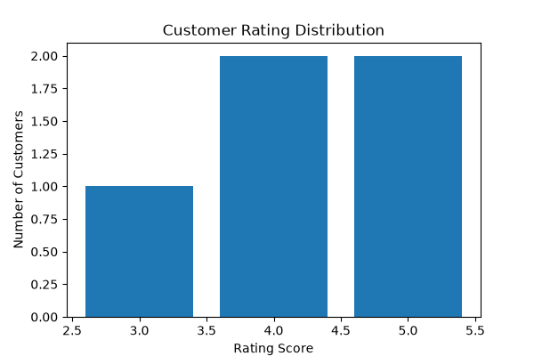
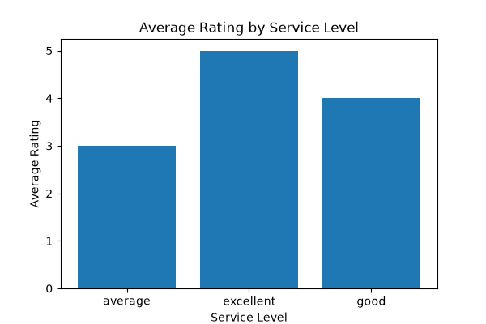
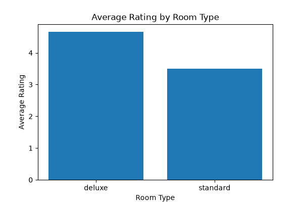
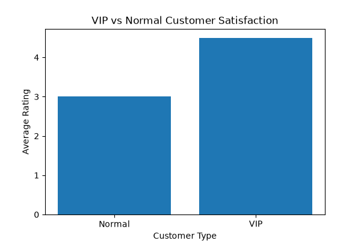

# Hotel Customer Satisfaction Analysis

## Project Overview

This project analyzes hotel customer satisfaction using Python and Pandas.

The project includes:
- Data preparation
- Customer classification
- Statistical analysis
- Service level analysis
- Room type analysis
- Data visualization

## Tools

- Python
- Pandas
- Matplotlib
- VS Code
- GitHub

## Project Structure

02_hotel_ai_project

├── hotel_real_data.py
│   └── Data cleaning and preprocessing
│
├── customer_rating_analysis.py
│   └── Customer segmentation and analysis
│
├── visualization.py
│   └── Data visualization
│
└── clean_hotel_data.csv
    └── Processed dataset

## How to Run

1. Install dependencies
pip install pandas matplotlib
2. Run analysis
python customer_rating_analysis.py
3. Run visualization
python visualization.py

## Data Processing

The project includes:

1. Data cleaning
2. Missing value handling
3. Customer classification
4. Customer satisfaction analysis
5. Data visualization

## Key Findings

1. VIP customers have higher satisfaction scores than normal customers.
2. Excellent service level achieves the highest average rating.
3. Deluxe room customers show higher satisfaction scores than standard room customers.

## Visualization Results

### Customer Rating Distribution

### Service Level Analysis

### Room Type Analysis

### Customer Type Analysis

